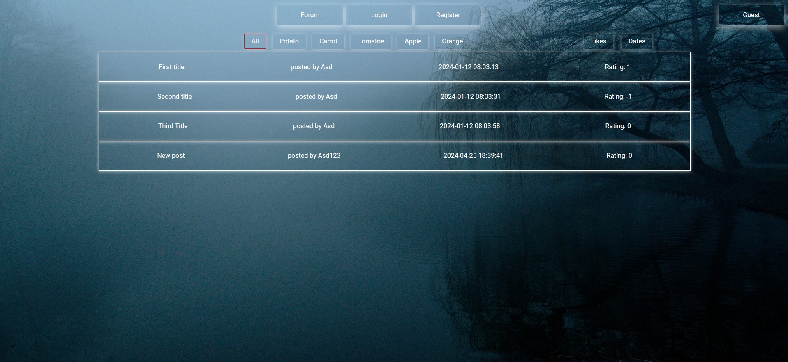

# Go Forums

## Project Description

Basic Forum written in Golang.
Frontend is provided with basic HTML and Golang Jinja

### Tech Stack:

- **Backend**: Golang
- **Database**: SQLite

## Table of Contents

- [How to Run the Project](#how-to-run-the-project)
  - [Run Locally](#run-locally)
- [Screenshots](#Screenshots)
- [Contributing](#contributing)
- [License](#license)
- [Contact](#contact)

## How to Run the Project

### Run Locally

To run the project locally, follow these steps:

#### Prerequisites

- Golang installed
- Clone the git repo to your PC.

#### Steps

2. **Run the backend**:
   
   ```bash
   go get
   go run .
   ```

Click [here](http://localhost:8080) to view the webpage

## Screenshots

Here's a screenshot of the project:



## Contributing

We welcome contributions! Please contact one of the authors in discord if you would like to contribute to future projects.

## License

This project is licensed under the MIT License. See the [LICENSE](https://opensource.org/license/mit) file for details.

## Contact

For any questions or suggestions, feel free to contact us directly at `Kood / Jõhvi Discord`.

_<sup>Authors: [Jaanus Saar](https://github.com/The-Estonian) [Oliver Vilu](https://github.com/husmer)_</sup>